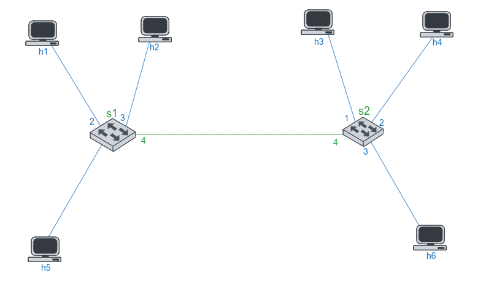
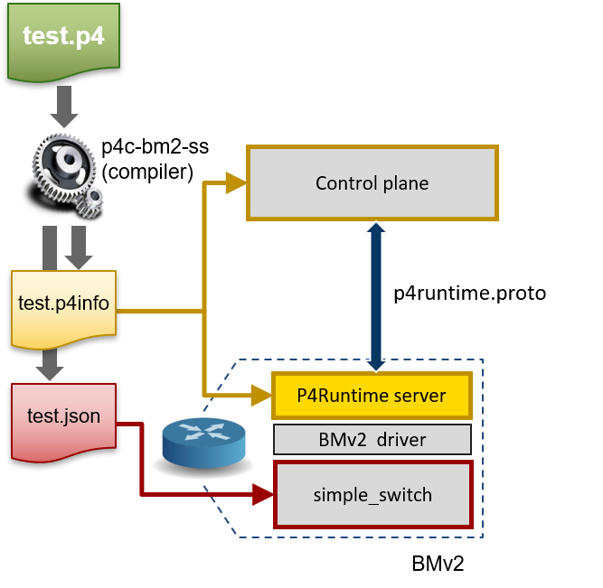
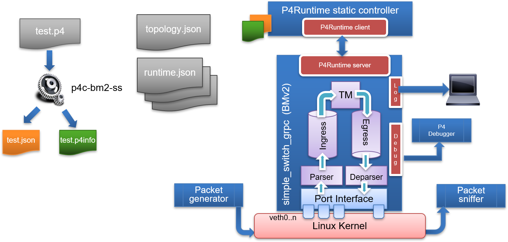
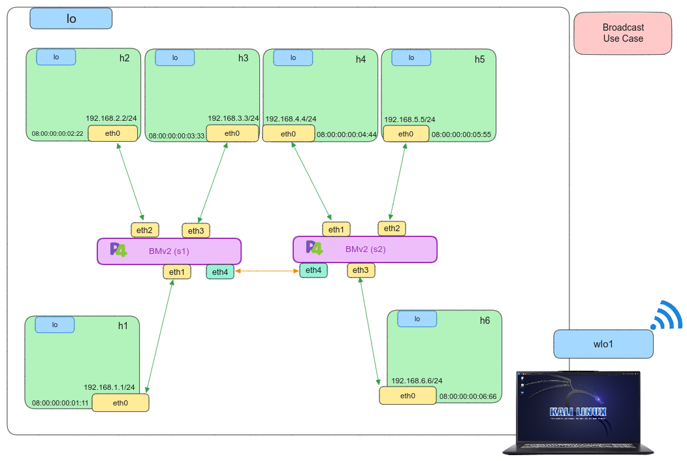

# P4 - Echo server

## Introduction

In this use case, we aim to use broadcast type to find the right destination.  The following figure shows the network topology for ``Broadcast`` use case.

<p align="center">
	
</p>

## Compilation

We'll compile our P4 program using the [``p4c``](https://github.com/p4lang/p4c) compiler, the reference compiler for P4. It has two compilation stages: the frontend generates a *.p4info file containing program attributes, and the backend generates target-specific files. 

<p align="center">
    
</p>

For instance, when targeting [``BMV2``](https://github.com/p4lang/behavioral-model), it creates a ``*.json`` file, defining the entire datapath as programmed.

## Setting up the scenario

To initiate the scenario, we've created a Makefile to compile our P4 program, resulting in *.p4info and *.json files. Next, we'll run the[``run_exercise.py``](https://github.com/Waiyankyawbelu/P4-Project/blob/main/utils/run_exercise.py) script, which will set up the network topology defined in the [``scenario/topology.json``](scenario/topology.json) file using [``Mininet``](https://github.com/mininet/mininet). Each switch in the topology will incorporate our P4 program logic, all managed within one BMV2 instance. The diagram below provides an overview of a single switch's configuration.

<p align="center">
    
</p>

To put the use case into action, we need to:
```bash
sudo make run
```

If we want to stop all the auxiliary files for loading the p4 program and minitnet, we have to write:

```bash
sudo make stop
```

After verifying the use case's proper operation, we have to clean up all the file such as ``build``, ``logs`` and ``pcaps``. We need to:

```bash
sudo make clean
```

## Testing

- Running ``make run`` sets up the described use case topology.
- The topology specifics are in a JSON file called [``topology.json``](scenario/topology.json) in the [``scenario``](scenario) directory.
- This file contains data about control plane files for each topology switch.
- We've followed the naming standard set by P4Lang, which uses ``sX-runtime.json``, with X indicating the switch's position in [``Mininet``](https://github.com/mininet/mininet).

<p align="center">
    
</p>

Then, we will have the CLI of [``Mininet``](https://github.com/mininet/mininet), so we will open two xterm terminals for ``host1``, ``host3``, ``host5`` and ``host6``.

```bash 
mininet> xterm h1 h3 h5 h6
```
With all terminals open, from the ``host1``, we conduct a ping to ``host6``. 

```bash 
# host1 xterm terminal
ping 192.168.6.6
```
On the other hand, we put to listen traffic by its interface in each ``host3``, ``host5`` and ``host6``.

```bash 
# host3 xterm terminal
tcpdump -l

# host5 xterm terminal
tcpdump -l

# host6 xterm terminal
tcpdump -l
```
or

We can open ``Wireshark`` to capture how to ``broadcast`` in the network.

```bash
sudo wireshark 
```

As a result, the connectivity will succeed. First, the switch will ask in its network who is the destination and then the destination in this case ``host6`` will reply to its switch. Additionally, we can examine the ``build``, ``logs`` and ``pcaps`` directories generated at the start of the scenario as follows: 

```bash
less build/drop.json
```

```bash
less logs/s1.log
```

```bash
wireshark pcaps/s1-eth1_out.pcap 
```

## References

*	 [Mininet](https://github.com/mininet/mininet)
*	 [P4 Tutorials](https://github.com/p4lang/tutorials) 
*	 [Advanced Topics in Communication Networks **ETH Zurich**](https://video.ethz.ch/lectures/d-itet/2022/autumn/227-0575-00L/c1df0f1b-d89b-4328-b9d7-7dfd26a5bb46.html)
*	 [RFC 792: ICMP](https://tools.ietf.org/html/rfc792)
*    [RFC 919: Broadcast](https://www.rfc-editor.org/rfc/rfc919.html)