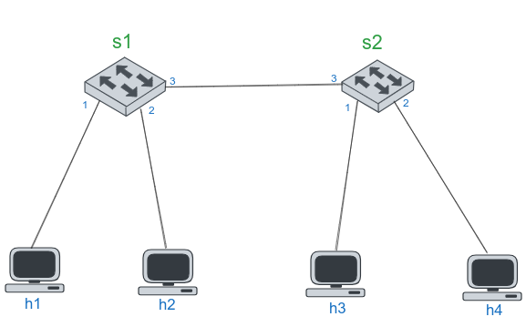
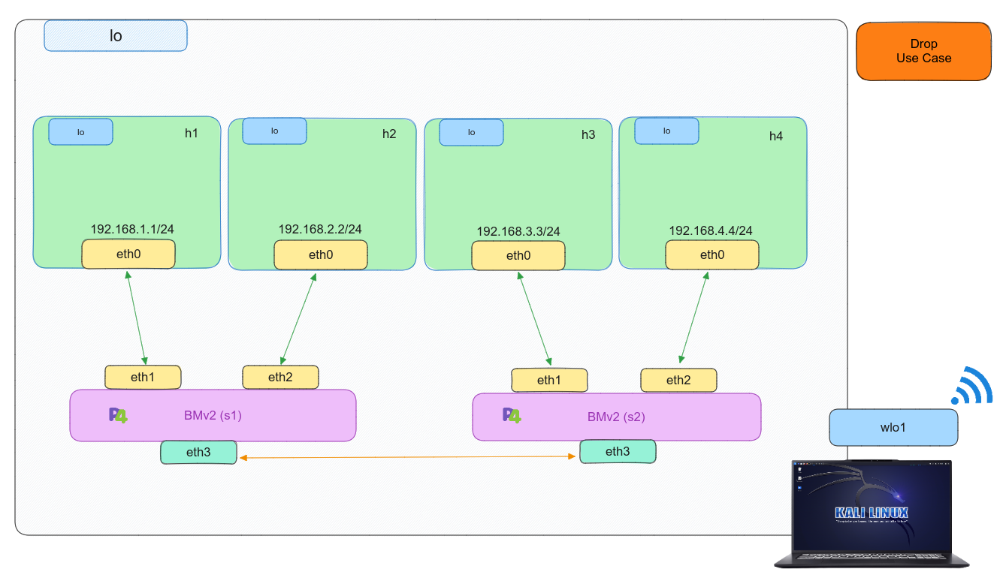

# Implementing Drop Use Case
## Introduction
Here is the topogoly for drop use case using P4 Programming. 

    

Here is the virtual topology inside the linux operation system for drop use case.

    

