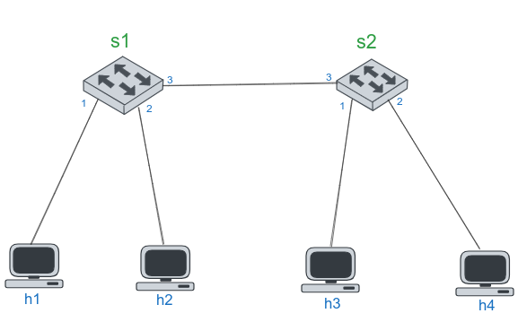
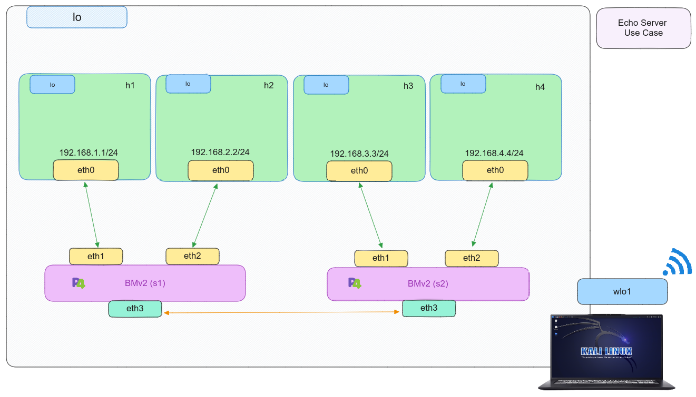

# P4 - Echo server

## Introduction

We're creating an echo server that responds to incoming pings. To test this, we'll use the [``behavioral-model``](https://github.com/p4lang/behavioral-model), [``BMV2``](https://github.com/p4lang/behavioral-model) switch software and [``Mininet``](https://github.com/mininet/mininet). Our network setup is identical to the [``Drop``](../Drop) use case.

<p align="center">
	
</p>

## Compilation

We'll compile our P4 program with the [``p4c``](https://github.com/p4lang/p4c) compiler. If you're new to this compiler or unsure about the compilation process, refer back to [``Drop``](../Drop) for a detailed explanation of how to compile a P4 program and the steps involved.

## Setting up the scenario


To put the use case into action, we need to:
```bash
sudo make run
```

If we want to stop all the auxiliary files for loading the p4 program and minitnet, we have to write:

```bash
sudo make stop
```

After verifying the use case's proper operation, we have to clean up all the file such as ``build``, ``logs`` and ``pcaps``. We need to:

```bash
sudo make clean
```

## Testing

- Running ``make run`` sets up the described use case topology.
- The topology specifics are in a JSON file called [``topology.json``](scenario/topology.json) in the [``scenario``](scenario) directory.
- This file contains data about control plane files for each topology switch.
- We've followed the naming standard set by P4Lang, which uses ``sX-runtime.json``, with X indicating the switch's position in [``Mininet``](https://github.com/mininet/mininet).

<p align="center">
    
</p>

Then, we will have the CLI of [``Mininet``](https://github.com/mininet/mininet), so we will open two xterm terminals for ``host1`` and ``host4``.

```bash 
mininet> xterm h1 h4
```
With both terminals open, from the ``host1``, we conduct a ping to ``host4``. 

```bash 
# host1 xterm terminal
ping 192.168.4.4
```
On the other hand, we put to listen ``ICMP`` traffic by its interface which is connected to ``s2-eth2``.

```bash 
# host4 xterm terminal
tcpdump -i s2-eth2 icmp
```
or

We can open ``Wireshark`` in port ``s2-eth2`` or ``s1-eth1`` to capture the ``ICMP`` traffice between ``host1`` and ``host2``.

```bash
sudo wireshark 
```

As a resul, the connectivity will succeed, indicating the correct functionality of the developedd P4 program for ``Echo Server``. Additionally, we can examine the ``build``, ``logs`` and ``pcaps`` directories generated at the start of the scenario as follows: 

```bash
less build/drop.json
```

```bash
less logs/s1.log
```

```bash
wireshark pcaps/s1-eth1_in.pcap
```

## References

*	 [Mininet](https://github.com/mininet/mininet)
*	 [P4 Tutorials](https://github.com/p4lang/tutorials) 
*	 [Advanced Topics in Communication Networks **ETH Zurich**](https://video.ethz.ch/lectures/d-itet/2022/autumn/227-0575-00L/c1df0f1b-d89b-4328-b9d7-7dfd26a5bb46.html)
*	 [RFC 8200: Internet Protocol, Version 6 (IPv6) Specification](https://tools.ietf.org/html/rfc8200)
*	 [RFC 792: ICMP](https://tools.ietf.org/html/rfc792)