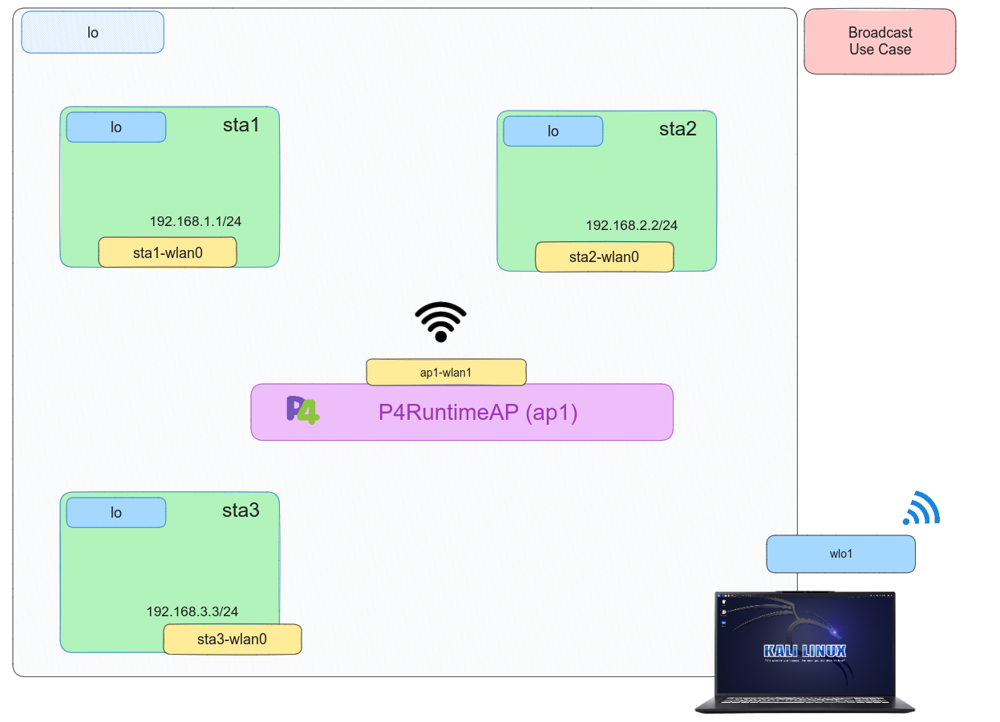

# P4 - Broadcast

## Introduction

In this test, we’ll create a P4 program for broadcasting, specifically at the link level (layer 2) on a virtual Wireless interface. All the details about this use cae have been previously covered in [``Broadcast``](../../P4/Broadcast/) of wired P4. Since no significant changes occur in the environment, only guidance on compiling and running the program will be given. In addition, it is important that ``Mininet-WiFi`` dependencies supporting ``BMv2`` are properly installed to replicate this use case.

## Compilation

For this use case, a ``Makefile`` has been prepared,
therefore it is not necessary for the user to make direct use of the p4c compile. If you want to
know more about how the compilation process works, what stages there are, how the generated ``JSON`` is injected into BMv2, or what different targets there are depending on the architecture, we recommend you to go back to [``Drop](../../P4/Drop/). Follow the provided steps to complete the compilation process.

```bash
sudo make 
```

## Setting up the scenario

Like compiling code, a Python script automates setting up the scenario by defining the topology for the specific use case. To start,run the provided command.

```bash
sudo python scenario.py
```

After verifying the use case's proper operation, we have to clean up all the file such as ``build``, ``logs`` and ``pcaps``. We need to:

```bash
sudo make clean
```

## Testing

After executin the script, the use case will establish the topology comprising three hosts and one instances [```P4RuntimeAP```] node. 

<p align="center">
    
</p>


Then, we will have the CLI of [``Mininet``](https://github.com/mininet/mininet).

```bash 
mininet-wifi> pingall
```


As results, the connectivities will succeed between hosts. Additionally, we can examine the ``build``, ``logs`` and ``pcaps`` directories generated at the start of the scenario as follows.

```bash
less build/broadcast.json
```

```bash
less logs/ap1.log
```

```bash
wireshark pcaps/ap1-wlan0-in.pcap 
```


## References

*	 [Mininet](https://github.com/mininet/mininet)
*	 [P4 Tutorials](https://github.com/p4lang/tutorials) 
*	 [Advanced Topics in Communication Networks **ETH Zurich**](https://video.ethz.ch/lectures/d-itet/2022/autumn/227-0575-00L/c1df0f1b-d89b-4328-b9d7-7dfd26a5bb46.html)
*	 [RFC 792: ICMP](https://tools.ietf.org/html/rfc792)
*    [RFC 919: Broadcast](https://www.rfc-editor.org/rfc/rfc919.html)