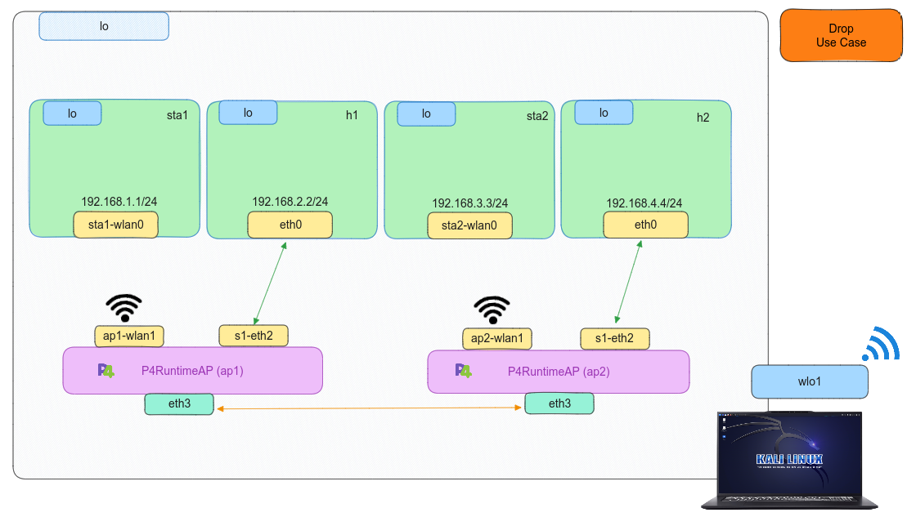

# P4 - Drop

## Introduction

In this use case, we aim to demonstrate the capability of discarding received packets using a P4 program on a virtual Wireless interface. As this use case is similar to the wired P4 Drop explained earlier [``Drop``](../../P4/Drop/) with no notable environmental differences discussed in the previous section, only instruction on compilation and implementation will be provided. In addition, it is essential to note that to replicate this use case, ensure that [```Mininet-WiFi```] dependencies with [```BMv2```] support are adequately installed.
## Compilation

For this use case, a Makefile simplifies compilation, eliminating the need for users to learn the [```p4c```] compiler process. To delve deeper into the compilation stages or targest based on architecture, you can check on [``Drop``](../../P4/Drop/). Simply follow the steps outlined for the compilation process.

```bash
sudo make 
```

## Setting up the scenario

Like compiling code, a Python script automates setting up the scenario by defining the topology for the specific use case. To start,run the provided command.

```bash
sudo python scenario.py
```

After verifying the use case's proper operation, we have to clean up all the file such as ``build``, ``logs`` and ``pcaps``. We need to:

```bash
sudo make clean
```

## Testing

After executin the script, the use case will establish the topology comprising four hosts and two instances of the [```P4RuntimeAP```] nodes. 

<p align="center">
    
</p>


Then, we will have the CLI of [``Mininet``](https://github.com/mininet/mininet), so we will open three xterm terminals for ``Wireless host1``, ``Wireless host2`` and ``host1``.

```bash 
mininet-wifi> xterm sta1 sta2 h1
```
With all terminals open, from the ``Wireless host1``, we conduct a ping to ``host1``. 

```bash 
# Wireless host1 xterm terminal
ping 192.168.1.2
```
On the other hand, we put to listen traffic by its interface in each ``wireless host2`` and ``host1``.


```bash 
# host1(h1) xterm terminal
tcpdump -l
```


However, the connectivity will not succeed, indicating the correct functionality of the developed P4 program. Additionally, we can examine the build, logs and pcaps directories generated at the start of the scenario as follows

```bash
less build/drop.json
```

```bash
less logs/ap1.log
```

```bash
wireshark pcaps/ap1-eth3-in.pcap 
```


## References

*	 [Mininet](https://github.com/mininet/mininet)
*	 [P4 Tutorials](https://github.com/p4lang/tutorials) 
*	 [Advanced Topics in Communication Networks **ETH Zurich**](https://video.ethz.ch/lectures/d-itet/2022/autumn/227-0575-00L/c1df0f1b-d89b-4328-b9d7-7dfd26a5bb46.html)
*	 [RFC 792: ICMP](https://tools.ietf.org/html/rfc792)
*    [RFC 919: Broadcast](https://www.rfc-editor.org/rfc/rfc919.html)