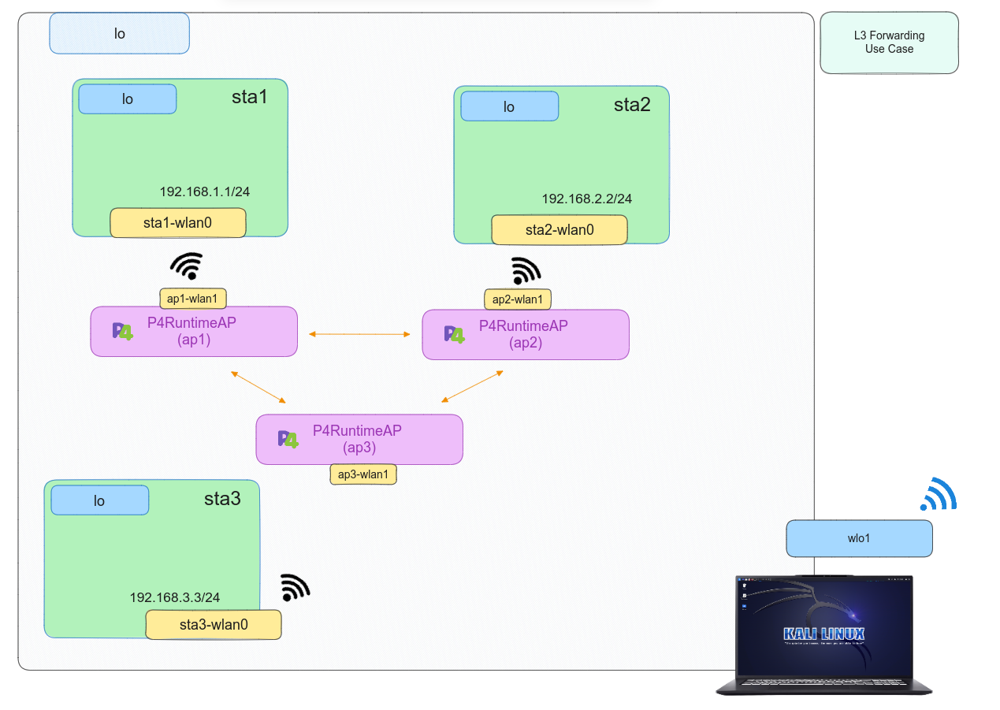

# P4 - Layer 3 Forwarding

## Introduction

In this use case, our aim is to implement forwarding at the network layer (layer 3), transforming our ``switch``  into a basic router with minimal functionalities on a virtual Wireless interface. All the details about this use cae have been previously covered in [``L3 Forwarding``](../../P4/L3_forwarding/) of wired P4. As there are no significant differences introduced in the change of environment, only instructions regarding compilation and execution will be provided. In addition, it is important that ``Mininet-WiFi`` dependencies supporting ``BMv2`` are properly installed to replicate this use case.

## Compilation

For this use case, a Makefile simplifies compilation, eliminating the need for users to learn the ``p4c`` compiler process. To delve deeper into the compilation stages or targest based on architecture, you can check on [``L3 Forwarding``](../../P4/L3_forwarding/). Follow the provided steps to complete the compilation process.

```bash
sudo make 
```

## Setting up the scenario

Like compiling code, a Python script automates setting up the scenario by defining the topology for the specific use case. To start,run the provided command.

```bash
sudo python scenario.py
```

After verifying the use case's proper operation, we have to clean up all the file such as ``build``, ``logs`` and ``pcaps``. We need to:

```bash
sudo make clean
```

## Testing

After executin the script, the use case will establish the topology comprising four hosts and two instances of the [```P4RuntimeAP```] nodes. 

<p align="center">
    
</p>


Then, we will have the CLI of [``Mininet``](https://github.com/mininet/mininet), so we will open three xterm terminals for ``Wireless host1``, ``Wireless host2`` and ``Wireless host3``.

```bash 
mininet-wifi> xterm sta1 sta2 sta3
```
With all terminals open, from the ``Wireless host1``, we conduct a ping to ``Wireless host2``. 

```bash 
# Wireless host1 xterm terminal
ping 192.168.2.2
```
On the other hand, we put to listen traffic by its interface in each ``wireless host2`` and ``wireless host3``.


```bash 
# sta2 xterm terminal
tcpdump -l
```
or

We can open ``Wireshark`` for port ``ap1-wlan1`` and ``ap3-wlan1`` to capture the ``ICMP`` traffic between ``wireless host1`` and ``wireless host2``.

```bash
sudo wireshark 

```

As results, the connectivities will succeed between hosts. Additionally, we can examine the ``build``, ``logs`` and ``pcaps`` directories generated at the start of the scenario as follows

```bash
less build/l3_forwarding.json
```

```bash
less logs/ap2.log
```

```bash
wireshark pcaps/ap2-eth2-in.pcap 
```


## References

*	 [Mininet](https://github.com/mininet/mininet)
*    [Mininet Wifi](https://github.com/intrig-unicamp/mininet-wifi/tree/master)
*	 [P4 Tutorials](https://github.com/p4lang/tutorials) 
*	 [Advanced Topics in Communication Networks **ETH Zurich**](https://video.ethz.ch/lectures/d-itet/2022/autumn/227-0575-00L/c1df0f1b-d89b-4328-b9d7-7dfd26a5bb46.html)
*	 [RFC 792: ICMP](https://tools.ietf.org/html/rfc792)
*    [RFC 919: Broadcast](https://www.rfc-editor.org/rfc/rfc919.html)